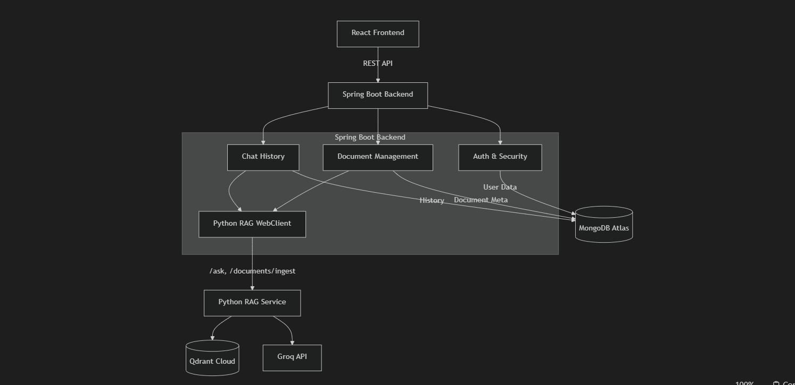

# Self-Healing RAG Platform

A full-stack, production-ready **Self-Healing Retrieval-Augmented Generation (RAG)** platform. 
It features a Java 21 Spring Boot Backend for Auth and Document Management, and a Python FastAPI microservice for the core RAG AI logic powered by Groq and Qdrant.

## Architecture Overview



### Self-Healing Logic (Python Service)

```text
User Question
     │
     ▼
┌─────────────┐
│  FastAPI     │  POST /ask
│  API Layer   │
└──────┬──────┘
       │
       ▼
┌──────────────────────────────────────────────────────────┐
│                  Orchestrator Service                     │
│                                                          │
│  Attempt 1: Retrieve(k=4)  → Validate → Generate → Critic│
│  Attempt 2: Rewrite → Retrieve(k=8)  → Validate → ...   │
│  Attempt 3: Rewrite → Retrieve(k=12) → Validate → ...   │
│  Fallback:  "Insufficient information"                   │
│                                                          │
└──────────────────────────────────────────────────────────┘
       │                    │                    │
       ▼                    ▼                    ▼
┌─────────────┐   ┌──────────────┐   ┌─────────────────┐
│  Qdrant     │   │  Groq LLM    │   │  Trace Storage  │
│  Vector DB  │   │  Provider    │   │  (JSON files)   │
└─────────────┘   └──────────────┘   └─────────────────┘
```

## Key Features

- **Self-Healing Pipeline**: 3-stage retry with escalating retrieval strategies
- **Retrieval Validation**: Validates chunk relevance before generation
- **Answer Grounding**: Critic evaluates if answers are grounded in context
- **Query Rewriting**: Automatically rewrites queries for better retrieval
- **Full Tracing**: Every request produces a detailed JSON trace
- **LLM Abstraction**: Swap Groq for OpenAI/Claude without changing services
- **Vector Store Abstraction**: Swap Qdrant for Pinecone/Weaviate/ChromaDB
- **Async Support**: Built for concurrent users with async/await
- **Source Citations**: Every answer includes source documents

## Project Structure

The platform is designed as a monorepo containing the microservices:

```text
RAG-Based-PDF-LLM/
│
├── rag-service/          # Python Self-Healing RAG Service
│   ├── app/              # FastAPI core logic (Orchestrator, Validator, Generator)
│   ├── documents/        # PDF & TXT documents
│   ├── scripts/          # Ingestion scripts
│   └── ...
│
├── spring-backend/       # Java Spring Boot API Gateway
│   ├── src/main/java/com/rag/backend/
│   │   ├── auth/         # MongoDB User & Refresh Token management
│   │   ├── chat/         # Conversational history
│   │   ├── document/     # Upload metadata
│   │   └── security/     # Google OAuth2 & JWT Filtering
│   ├── Dockerfile
│   └── docker-compose.yml
│
└── frontend/             # (Upcoming) React UI
```

## Quick Start

### Prerequisites

- Python 3.11+
- Docker (for Qdrant) or Qdrant Cloud account
- Groq API key

### 1. Install Dependencies

```bash
pip install -r requirements.txt
```

### 2. Start Qdrant (Local Docker)

```bash
docker run -p 6333:6333 -p 6334:6334 qdrant/qdrant
```

### 3. Configure Environment

Edit `.env` with your credentials:

```env
GROQ_API_KEY=your_groq_api_key_here
GROQ_MODEL=llama-3.3-70b-versatile
QDRANT_URL=http://localhost:6333
```

### 4. Ingest Documents

Place your `.txt` files in the `documents/` directory, then run:

```bash
python scripts/ingest_documents.py
```

### 5. Start the Server

```bash
uvicorn app.main:app --reload --host 0.0.0.0 --port 8000
```

### 6. Test the API

```bash
# Ask a question
curl -X POST http://localhost:8000/ask \
  -H "Content-Type: application/json" \
  -d '{"question": "Does the text prove that Rama historically existed?"}'

# Health check
curl -X POST http://localhost:8000/health
```

## API Endpoints

### POST /ask

**Request:**
```json
{
  "question": "Does the text prove that Rama historically existed?"
}
```

**Response:**
```json
{
  "answer": "Based on the provided context...",
  "sources": ["ram.txt"],
  "confidence": 0.91,
  "retrieval_confidence": 0.88,
  "attempts": 1,
  "status": "APPROVED"
}
```

### POST /health

**Response:**
```json
{
  "api": "UP",
  "groq": "UP",
  "qdrant": "UP"
}
```

## Self-Healing Strategy

| Attempt | Strategy     | Top-K | Threshold | Query Rewrite |
|---------|-------------|-------|-----------|---------------|
| 1       | Default     | 4     | 0.30      | No            |
| 2       | Expanded    | 8     | 0.30      | Yes           |
| 3       | Aggressive  | 12    | 0.20      | Yes           |

## Deployment / Getting Started

### 1. Spring Boot Backend
Configure your `.env` in `spring-backend/` with Google OAuth credentials and MongoDB URI.
```bash
cd spring-backend
docker compose up --build
```

### 2. Python RAG Service
Ensure Qdrant is running, and configure your Groq credentials.
```bash
uvicorn app.main:app --reload --port 8000
```

## License

MIT
