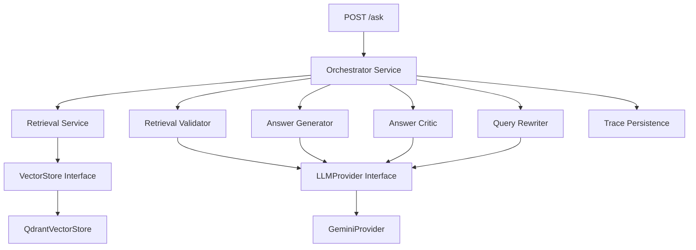

# Self-Healing RAG Microservice — Walkthrough

## Summary

Transformed the existing two-script RAG project (`ingestion-pipeline.py` + `retrivalpipeline.py` with ChromaDB) into a **production-ready Self-Healing RAG microservice** with 25+ files following SOLID principles, async/await, and full abstraction layers.

## What Was Built

### Architecture

### Files Created (25 files)

| Layer | Files |
|-------|-------|
| **Interfaces** | [llm_provider.py](file:///c:/Users/praka/OneDrive/Desktop/Current-Need/Rag/RAG-Based-PDF-LLM/app/interfaces/llm_provider.py), [vector_store.py](file:///c:/Users/praka/OneDrive/Desktop/Current-Need/Rag/RAG-Based-PDF-LLM/app/interfaces/vector_store.py) |
| **Providers** | [gemini_provider.py](file:///c:/Users/praka/OneDrive/Desktop/Current-Need/Rag/RAG-Based-PDF-LLM/app/providers/gemini_provider.py), [qdrant_vector_store.py](file:///c:/Users/praka/OneDrive/Desktop/Current-Need/Rag/RAG-Based-PDF-LLM/app/providers/qdrant_vector_store.py) |
| **Services** | [retrieval_service.py](file:///c:/Users/praka/OneDrive/Desktop/Current-Need/Rag/RAG-Based-PDF-LLM/app/services/retrieval_service.py), [retrieval_validator.py](file:///c:/Users/praka/OneDrive/Desktop/Current-Need/Rag/RAG-Based-PDF-LLM/app/services/retrieval_validator.py), [answer_generator.py](file:///c:/Users/praka/OneDrive/Desktop/Current-Need/Rag/RAG-Based-PDF-LLM/app/services/answer_generator.py), [answer_critic.py](file:///c:/Users/praka/OneDrive/Desktop/Current-Need/Rag/RAG-Based-PDF-LLM/app/services/answer_critic.py), [query_rewriter.py](file:///c:/Users/praka/OneDrive/Desktop/Current-Need/Rag/RAG-Based-PDF-LLM/app/services/query_rewriter.py), [orchestrator_service.py](file:///c:/Users/praka/OneDrive/Desktop/Current-Need/Rag/RAG-Based-PDF-LLM/app/services/orchestrator_service.py) |
| **Models** | [request_models.py](file:///c:/Users/praka/OneDrive/Desktop/Current-Need/Rag/RAG-Based-PDF-LLM/app/models/request_models.py), [response_models.py](file:///c:/Users/praka/OneDrive/Desktop/Current-Need/Rag/RAG-Based-PDF-LLM/app/models/response_models.py), [trace_models.py](file:///c:/Users/praka/OneDrive/Desktop/Current-Need/Rag/RAG-Based-PDF-LLM/app/models/trace_models.py), [document_models.py](file:///c:/Users/praka/OneDrive/Desktop/Current-Need/Rag/RAG-Based-PDF-LLM/app/models/document_models.py) |
| **Prompts** | [generation_prompt.txt](file:///c:/Users/praka/OneDrive/Desktop/Current-Need/Rag/RAG-Based-PDF-LLM/app/prompts/generation_prompt.txt), [critic_prompt.txt](file:///c:/Users/praka/OneDrive/Desktop/Current-Need/Rag/RAG-Based-PDF-LLM/app/prompts/critic_prompt.txt), [rewrite_prompt.txt](file:///c:/Users/praka/OneDrive/Desktop/Current-Need/Rag/RAG-Based-PDF-LLM/app/prompts/rewrite_prompt.txt), [retrieval_validator_prompt.txt](file:///c:/Users/praka/OneDrive/Desktop/Current-Need/Rag/RAG-Based-PDF-LLM/app/prompts/retrieval_validator_prompt.txt) |
| **Config** | [settings.py](file:///c:/Users/praka/OneDrive/Desktop/Current-Need/Rag/RAG-Based-PDF-LLM/app/config/settings.py), [.env](file:///c:/Users/praka/OneDrive/Desktop/Current-Need/Rag/RAG-Based-PDF-LLM/.env) |
| **API** | [routes.py](file:///c:/Users/praka/OneDrive/Desktop/Current-Need/Rag/RAG-Based-PDF-LLM/app/api/routes.py), [main.py](file:///c:/Users/praka/OneDrive/Desktop/Current-Need/Rag/RAG-Based-PDF-LLM/app/main.py) |
| **Utils** | [logger.py](file:///c:/Users/praka/OneDrive/Desktop/Current-Need/Rag/RAG-Based-PDF-LLM/app/utils/logger.py) |
| **Scripts** | [ingest_documents.py](file:///c:/Users/praka/OneDrive/Desktop/Current-Need/Rag/RAG-Based-PDF-LLM/scripts/ingest_documents.py) |
| **Docs** | [README.md](file:///c:/Users/praka/OneDrive/Desktop/Current-Need/Rag/RAG-Based-PDF-LLM/README.md) |

### Self-Healing Strategy

| Attempt | Strategy | Top-K | Threshold | Rewrite | Pipeline |
|---------|----------|-------|-----------|---------|----------|
| 1 | Default | 4 | 0.30 | ✗ | Retrieve → Validate → Generate → Critic |
| 2 | Expanded | 8 | 0.30 | ✓ | Rewrite → Retrieve → Validate → Generate → Critic |
| 3 | Aggressive | 12 | 0.20 | ✓ | Rewrite → Retrieve → Validate → Generate → Critic |

### Key Design Decisions

1. **LLMProvider / VectorStore abstractions** — All services depend on interfaces, not implementations. Swap Gemini → OpenAI or Qdrant → Pinecone by creating a new provider class.
2. **Retrieval Validator** — Checks if retrieved chunks are relevant *before* calling the answer generator, saving LLM calls on bad retrievals.
3. **Trace system** — Every `/ask` request generates a `traces/{request_id}.json` file capturing all attempts, scores, and verdicts.
4. **FastAPI lifespan DI** — Services are wired via `dependency_overrides` in the lifespan context, avoiding global state.
5. **Prompt files** — Prompts are external TXT files, making them editable without code changes.
6. **Document models ready** — `document_models.py` is architecture-ready for future upload/list/delete endpoints.

## Next Steps to Run

1. `pip install -r requirements.txt`
2. Start Qdrant: `docker run -p 6333:6333 qdrant/qdrant`
3. Set your `GEMINI_API_KEY` in `.env`
4. Ingest: `python scripts/ingest_documents.py`
5. Run: `uvicorn app.main:app --reload`
6. Test: `POST http://localhost:8000/ask` with `{"question": "..."}`
